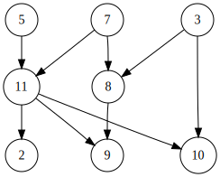

# Search

* [Binary Search](#Binary-Search)
* [Tree Traversal](#Tree-Traversal)
* [Depth First Search](#Depth-First-Search)(DFS)
* [Breadth First Search](#Breadth-First-Search)(BFS)
* [Dijkstra Algorithm](#Dijkstra-Algorithm)(find the shortest path)
* [Prim's Algorithm](#Prim's-Algorithm)(find minimum spanning tree for weighted undirected graph)
* [Topological Sorting](#Topological-Sorting)(DBS based)

## [Binary Search](BinarySearch.java)

**Binary Search** searches a sorted array by repeatedly dividing the serach interval in half.

#### Code Implementation

```java
public class BinarySearch{
    public boolean binarySearch(int arr[], int start, int end, int target){
        if(end >= start){
            int mid = (end - start) / 2 + start;

            if(target == arr[mid])
                return true;
            if(target < arr[mid])
                return binarySearch(arr, start, mid - 1, target);
            return binarySearch(arr, mid + 1, end, target);
        }
        return false;
    }

    public static void main(String[] args) {
        int arr[] = {2, 4, 6, 7, 10};
        BinarySearch bs = new BinarySearch();
        System.out.println(bs.binarySearch(arr, 0, arr.length, 3));
        System.out.println(bs.binarySearch(arr, 0, arr.length, 7));
    }
}
```


## [Tree Traversal](TreeNode.java)

* DFS
  * Pre-order
  * In-order
  * Post-oder
* Level-order (BFS)

#### Code Implementation

```java

public class TreeNode {
    
    static class Node{
        int key;
        Node leftChild, rightChild;

        public Node(int key){
            this.key = key;
            leftChild = rightChild = null;
        }
    }

    Node root;
    public TreeNode(){
        root = null;
    }

    public void postOrder(Node tree){
        if(tree == null)
            return;
        postOrder(tree.leftChild);
        postOrder(tree.rightChild);
        System.out.print(tree.key + ", ");
    }

    public void inOrder(Node tree){
        if(tree == null)
            return;
        inOrder(tree.leftChild);
        System.out.print(tree.key + ", ");
        inOrder(tree.rightChild);    
    }

    public void preOrder(Node tree){
        if(tree == null)
            return;
        System.out.print(tree.key + ", ");
        preOrder(tree.leftChild);
        preOrder(tree.rightChild);
    }

    public void levelOrder(Node tree){
        int h = height(tree);
        for(int i = 0; i<=h; ++i)
            lOrder(tree, i);
    }

    public int height(Node tree){
        if(tree == null)
            return 0;
        else{
            int lheight = height(tree.leftChild);
            int rheight = height(tree.rightChild);

            return Math.max(lheight, rheight) + 1 ;
        }
    }

    public void lOrder(Node tree, int level){
        if(tree == null)
            return;
        if(level == 1)
            System.out.print(tree.key + ", ");
        else if (level > 1){
            lOrder(tree.leftChild, level-1);
            lOrder(tree.rightChild, level-1);
        }
    }

    public static void main(String[] args) {

        TreeNode tree = new TreeNode();
        tree.root = new Node(1);
        tree.root.leftChild = new Node(2);
        tree.root.rightChild = new Node(3);
        tree.root.leftChild.leftChild = new Node(4);
        tree.root.leftChild.rightChild = new Node(5);
        System.out.println("Post-order: ");
        tree.postOrder(tree.root);
        System.out.println("\nIn-Order: ");
        tree.inOrder(tree.root);
        System.out.println("\nPre-order: ");
        tree.preOrder(tree.root);
        System.out.println("\nLevel-order: ");
        tree.levelOrder(tree.root);
    }
}

```

## Depth First Search

**Depth First Search** for an algorithm for traversing a tree or graph. The algorithm stats at the root node and explores as far as possible along each branch before backtracking

#### Steps for traversing a graph

1. Arbtrarily select a vertex as root node. Mark the root node
2. Move to the adjacent unmarked node
3. Repeat step (2) untill there is no adjacent unmarked node
4. Backtrack and check for other unmarked nodes and traverse them

#### Animation


#### Complexity Analysis

* Time complexity: O(V+E)
* Space complexity: O(V)

#### Psuedo-code

```
Algorithm DFS(G, u):
Input: A graph G and a vertex u of G
Output: A collection of vertices recheable from u, with their discovery edges

Mark u as visited
for each u's adjacent edges e(u, v) do:
	if v is not visited
		record e as discovery edge for v
		DFS(G, v)
```


## Breadth First Search

**Breadth First Search** starts at the root node and eplores all of the neighbor nodes at the pesent depth prior to moving on to the nodes at next depth level

#### Animation


#### Complexity Analysis

* Time complexity: O(V+E)
* Space complexity: O(V)

#### Pseudocode

```
Algorithm label(G):
Input: Graph G
Output: labelling of edges and vertices of G

for all vertices v of G
	setLabel(v, unexplored)
for all edges e of G
	setLabel(e, unexplored)

Algorithm BFS(G, u):
Input: A graph G and root node u
Output: BFS order

Q <- new empty queue
setLabel(u, visited)
Q.add(u)
while !Q.isEmpty() do:
	v = Q.dequeue()
	for each w in v.adjacentVertices()
		if w.lable = unexplored
			setLabel(w, visited)
			Q.add(w)
```


## Dijkstra Algorithm

**Dijkstra Algorithm** is an algorithm for finding the shortest path between nodes in a graph.

#### Psuedocode

```
Algorithm ShortedPath(G, s):
input: A graph G, starting node s
output: shortest path form s to v for each vertext of G

D[s]=0
for each v!=s do:
	D[v]=MAX
Q = priority queue containing (D[v], v) pairs
while Q is not empty do:
	u=Q.removeMin().getValue()
	for each vertex v adjacent to u such that v is in Q do:
		if D[u]+w(u,v)<D[v] then:
			D[v]=D[u]+w(u,v)
			Q.replaceKey(D[v], v)
return the label D[v] of each vertex v

```


## Prim's Algorithm

**Prim's Algorithm** is a greedy algorithm that finds a minimum spanning tree for a weighted undirected graph

#### Spanning Tree

A Subgraph of a graph G containing all the vertices of G. It starts with an empty spanning tree. The idea is to maintain two set of vertices. The first set contains the vertices already included in the MST, the other set contains the vertices not yet inlcuded. At every step, it considers all the edges that connect the two sets, and pick the minumus weight edge from these edges. After picking the edge, it moves the other endpoint of the edge to the set containing MST

#### Minimu Spanning Tree

A Spanning tree of a werighted graph with minimal total edge weight

#### Algorithm Idea

1. Create a set mstSet that keeps track of vertices already included in MST
2. Assign a key value to all vertices in the input graph.
   1. Initialize all key values as INFINITE.
   2. Assign key value as 0 for the frist vertex so that it can be picked first
3. While mstSet doesn't include all vertices
   1. Pick a vertex u which is not there in mstSet and has minimum key value
   2. Include u to mstSet
   3. Update key value of all adjacent vertices of u

#### Psuedocode

```
Algorithm MST(G):
Input: An undirected, weighted, connected graph G with n vertices, m edges
Output: A minimum spanning tree of G

Pick any vertext S of G
D(S) <- 0
for eaxh vertices v!=S do
	D(V) <- MAX
T <- an empty tree
Q <- A priority Q with an entry(D[v], (v, None)) for each vertext v
while Q is not empty do:
	(u, e) = Q.removeMin().getValue()
	Connect u to T using edge e
	for each edge e' = (u, v) such that v is in Q do:
		if w(u, v) < D[v] then:
			D[v]=w[u,v]
			replaceEntry(D[v], (V, e'))
return T
```

#### Complexity Analysis

Time complexity: O(mlogn)

## Topological Sorting

**Topological Sorting** is a linear odering of vertices such that for every directed graph edge u-v, vertex u comes before v in the ordering. This only applies to Directed Acyclic Graph

#### Example



The possible valid topological sorts for the above graph:

* `5, 7, 3, 11, 8, 2, 9, 10`
* `5, 7, 11, 2, 3, 8, 9, 10`
* `7, 3, 8, 5, 11, 2, 9, 10`

An invalid topological sort

* `5, 11, 2, 9, 3, 8, 10`

  9 cannot be visited before 8