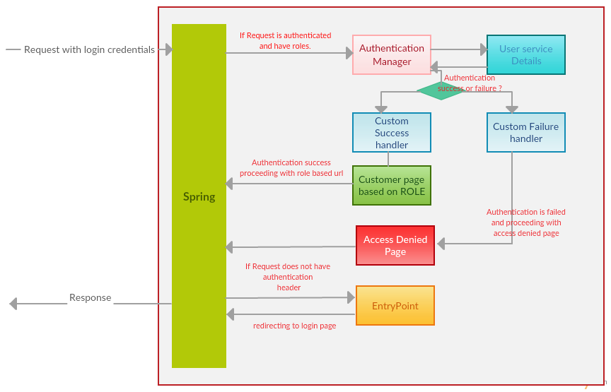

# [Spring Security](https://docs.spring.io/spring-security/site/docs/4.2.3.RELEASE/reference/htmlsingle/)

* Spring Security defines a framework for security
* Implemeted using Servlet filters in the background
* Two methods of securing a Web app: declarative and programmatic

## Servlet Filters

* Servlet Filters are used to pre-process/post-process web requests
* Servlet Filters can route web requests based on security logic
* Spring provides a bulk of security functionality with servlet filters

## Security Concepts

#### Authentication

* check user id and password with credential stored in app/db

#### Authorization

* Check to see if user has an authorized role

## Declarative Security

* Define application's security constraints in configuration
* Provide separation of concerns between application code and security

## Programmatic Security

* Spring Security provides an API for custom application coding
* Provide greater customization for specific app requirements

## Login Mehtods

* HTTP Basic Authentication
* Default login form
  * Spring security provides a default login form
* Custom login form

## Corss-site Request Forgery (CSRF)

A security attack where an evil website tricks you into executing an action on a web application that you are currently logged in

#### Protection

* Spring Security uses Sychronizer Token Pattern
  * Each request includes a sesscion cookie and randomly generated token
* For request processing, Spring security verifies token before processing

