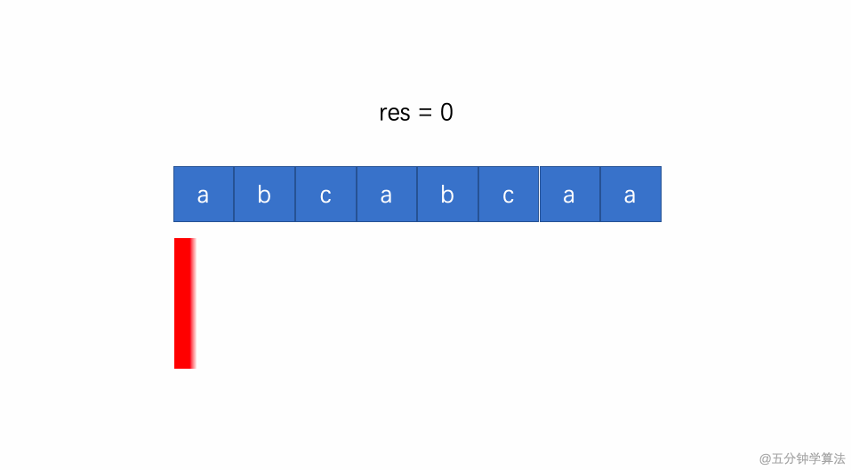

# [Longeset Substring without Repeating Characters](https://leetcode.com/problems/longest-substring-without-repeating-characters/solution/)

## Description

Given a string `s`, find the length of the **longest substring** without repeating characters.

## Example

```
Input: s = "abcabcbb"
Output: 3
Explanation: The answer is "abc", with the length of 3.
```

## Solution

#### Explanation

1. The fast pointer indicates the move to read characters; namely, the position of the last character of the substring
2. The slow pointer indicates the position of the first character of the substring
3. The key indicates the character, while the value is the last occurrance of the character in the Map
4. Move the slow pointer next to the repulicate element



```java
class Solution {
    public int lengthOfLongestSubstring(String s) {
        Map<Character, Integer> substr = new HashMap<>();
        int fast, slow = 0, max = 0;
        for(fast = 0; fast < s.length(); fast++){
            Character c = s.charAt(fast);
            if(substr.containsKey(c)){
                slow = Math.max(slow, substr.get(c)+1);
            }
            substr.put(c, fast);
            max = Math.max(max, fast-slow+1);
        }
        return max;
    }
}
```

