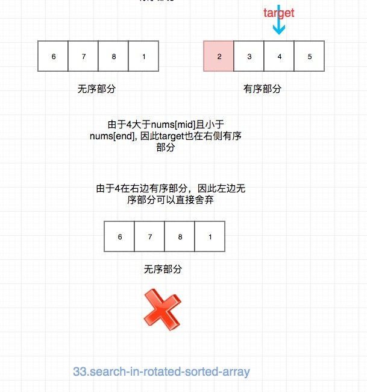

# [Search In Rotated Sorted Array](https://leetcode.com/problems/search-in-rotated-sorted-array/)

## Description

You are given an integer array `nums` sorted in ascending order, and an integer `target`.

Suppose that `nums` is rotated at some pivot unknown to you beforehand (i.e., `[0,1,2,4,5,6,7]` might become `[4,5,6,7,0,1,2]`).

*If `target` is found in the array return its index, otherwise, return `-1`.*

## Example

```
Input: nums = [4,5,6,7,0,1,2], target = 0
Output: 4
```

```
Input: nums = [4,5,6,7,0,1,2], target = 3
Output: -1
```

## Solution



```java
class Solution {
    public int search(int[] nums, int target) {
        if(nums == null || nums.length == 0)
            return -1;
        int left = 0;
        int right = nums.length - 1;
        while(left <= right){
            int mid = (right + left) / 2;
            if(nums[mid] == target)
                return mid;
            if(nums[left] <= nums[mid]){
                if(nums[left] <= target && target < nums[mid])
                    right = mid - 1;
                else
                    left = mid + 1;
            }else{
                if(nums[mid] < target && target <= nums[right])
                    left = mid + 1;
                else
                    right = mid - 1;
            }
        }
        return -1;
    }
}
```

