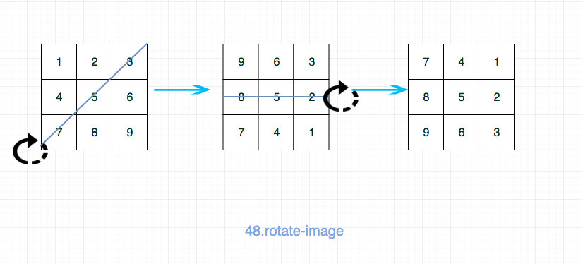

# [Rotate Image](https://leetcode.com/problems/rotate-image/)

## Description

You are given an *n* x *n* 2D `matrix` representing an image, rotate the image by 90 degrees (clockwise).

You have to rotate the image [**in-place**](https://en.wikipedia.org/wiki/In-place_algorithm), which means you have to modify the input 2D matrix directly. **DO NOT** allocate another 2D matrix and do the rotation.

## Example


```
Input: matrix = [[1,2,3],[4,5,6],[7,8,9]]
Output: [[7,4,1],[8,5,2],[9,6,3]]
```


```
Input: matrix = [[5,1,9,11],[2,4,8,10],[13,3,6,7],[15,14,12,16]]
Output: [[15,13,2,5],[14,3,4,1],[12,6,8,9],[16,7,10,11]]
```

## Solution 1



```java
class Solution {
    public void rotate(int[][] matrix) {
        if(matrix == null || matrix.length != matrix[0].length)
            return;
        int n= matrix.length;
        for(int i = 0; i<n-1; i++){
            for(int j = 0; j<n-i; j++){
                int temp = 0;
                temp = matrix[i][j];
                matrix[i][j] = matrix[n-j-1][n-i-1];
                matrix[n-j-1][n-i-1] = temp;
            }
        }
        for(int i =0 ; i<n/2; i++){
            for(int j = 0; j<n; j++){
                int temp = 0;
                temp = matrix[i][j];
                matrix[i][j] = matrix[n-i-1][j];
                matrix[n-i-1][j] = temp;
            }
        }
    }
}
```


## Solution 2

```java
class Solution {
    public void rotate(int[][] matrix) {
        if(matrix == null || matrix.length != matrix[0].length)
            return;
        for(int i = 0; i<matrix.length; i++){
            for(int j = i; j<matrix[0].length; j++){
                int temp = 0;
                temp = matrix[i][j];
                matrix[i][j] = matrix[j][i];
                matrix[j][i] = temp;
            }
        }
        for(int i =0 ; i<matrix.length; i++){
            for(int j = 0; j<matrix.length/2; j++){
                int temp = 0;
                temp = matrix[i][j];
                matrix[i][j] = matrix[i][matrix.length-1-j];
                matrix[i][matrix.length-1-j] = temp;
            }
        }
    }
}
```

## Solution 3


```java
class Solution {
    public void rotate(int[][] matrix) {
        int N = matrix.length;
        for (int i = 0; i < N/2; i++) {
            for (int j = 0; j < (N+1)/2; j++) {
                int t = matrix[i][j];
                matrix[i][j] = matrix[N-1-j][i];
                matrix[N-1-j][i] = matrix[N-1-i][N-1-j];
                matrix[N-1-i][N-1-j] = matrix[j][N-1-i];
                matrix[j][N-1-i] = t;
            }
        }
    }
}
```

