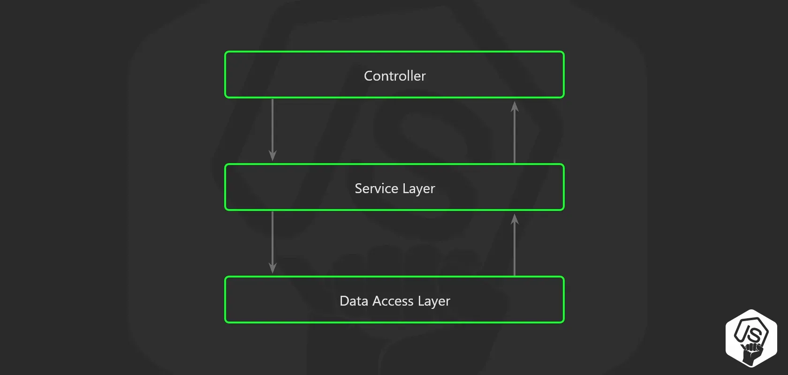

# NodeJs Architecture

## Folder structure

```
src
│   app.js          # App entry point
└───api             # Express route controllers for all the endpoints of the app
└───config          # Environment variables and configuration related stuff
└───jobs            # Jobs definitions for agenda.js
└───loaders         # Split the startup process into modules
└───models          # Database models
└───services        # All the business logic is here
└───subscribers     # Event handlers for async task
└───types           # Type declaration files (d.ts) for Typescript
```

## 3 layer architecture



* Use a service layer for the business logic -- collection with clear purpose -- ***NO*** SQL query (data access layer instead)
  * move your code away form express.js router
  * don't pass the req or res object to the service layer
  * don't return anything related to the HTTP transport layer like a status code or headers from the service layer
* 

